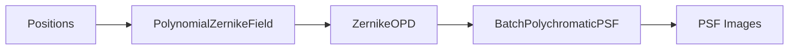
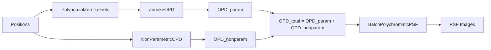
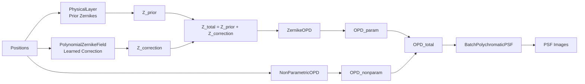

# PSF Models

WaveDiff-JAX provides three PSF model architectures, each building on the previous one with increasing complexity. All models are registered in a factory and can be instantiated by name.

## Model Registry

Models are registered via the `@register_psfclass` decorator:

```python
import wavediff_jax as wdj

# Available models
print(wdj.PSF_FACTORY.keys())
# dict_keys(['poly', 'semi-param', 'physical-poly',
#            'ground-truth-semi-param', 'ground-truth-physical-poly'])

# Instantiate via factory
model = wdj.get_psf_model(model_params, training_params, data)
```

## Common Setup

All models require a Zernike basis and obscuration mask:

```python
from wavediff_jax.utils.math_utils import generate_zernike_maps_3d, obscurations_from_params

zernike_maps = generate_zernike_maps_3d(n_zernikes=45, pupil_diam=256)
obscurations = obscurations_from_params(pupil_diam=256)
```

## Parametric Model

**Registry ID:** `"poly"`

The simplest architecture. A trainable polynomial field maps positions to Zernike coefficients, which are converted to OPD maps and then to PSFs via FFT diffraction.



```python
from wavediff_jax.models.parametric import ParametricPSFFieldModel

model = ParametricPSFFieldModel(
    zernike_maps=zernike_maps,
    obscurations=obscurations,
    output_Q=1,
    output_dim=64,
    n_zernikes=45,
    d_max=2,             # polynomial degree for field variation
    x_lims=[0, 1e3],
    y_lims=[0, 1e3],
    key=jax.random.PRNGKey(0),
)

# Forward pass
psf_batch, opd_maps = model([positions, packed_seds])

# Auxiliary predictions
opd = model.predict_opd(positions)
mono = model.predict_mono_psfs(positions, lambda_obs=0.8, phase_N=914)
```

**Trainable parameters:** `poly_field.coeff_mat` — shape `(n_zernikes, n_poly)`

## Semi-Parametric Model

**Registry ID:** `"semi-param"`

Extends the parametric model with a non-parametric OPD component that captures residuals beyond what the polynomial field can model.



Three non-parametric variants:

| Variant | Class | Description |
|---|---|---|
| `"poly"` | `NonParametricPolynomialOPD` | Polynomial spatial basis with trainable OPD maps |
| `"mccd"` | `NonParametricMCCDOPD` | Hybrid polynomial + graph-based spatial dictionary |
| `"graph"` | `NonParametricGraphOPD` | Graph-only spatial dictionary with RBF interpolation |

```python
from wavediff_jax.models.semiparametric import SemiParametricField

model = SemiParametricField(
    zernike_maps=zernike_maps,
    obscurations=obscurations,
    output_Q=1,
    output_dim=64,
    n_zernikes=45,
    d_max=2,
    d_max_nonparam=3,
    nonparam_model_class="poly",  # or "mccd", "graph"
    x_lims=[0, 1e3],
    y_lims=[0, 1e3],
    key=jax.random.PRNGKey(0),
)
```

### Functional Mutations

Semi-parametric models support functional state updates:

```python
from wavediff_jax.models.semiparametric import (
    set_alpha_zero,
    set_alpha_identity,
    project_DD_features,
)

# Zero out non-parametric component
model = set_alpha_zero(model)

# Restore identity mixing
model = set_alpha_identity(model)

# Project data-driven features onto Zernike basis
model = project_DD_features(model, S_matrix)
```

## Physical Polychromatic Model

**Registry ID:** `"physical-poly"`

The most sophisticated architecture. Combines:

1. **Physical prior:** Zernike coefficients from ray-tracing or optical modelling
2. **Parametric correction:** Learned polynomial field to correct the prior
3. **Non-parametric refinement:** Data-driven OPD component for residuals



```python
from wavediff_jax.models.physical_polychromatic import PhysicalPolychromaticField

model = PhysicalPolychromaticField(
    zernike_maps=zernike_maps,
    obscurations=obscurations,
    obs_pos=observation_positions,   # (n_obs, 2)
    zks_prior=zernike_prior,         # (n_obs, n_zks)
    output_Q=1,
    output_dim=64,
    n_zernikes_param=45,
    n_zks_total=45,
    d_max=2,
    d_max_nonparam=3,
    x_lims=[0, 1e3],
    y_lims=[0, 1e3],
    key=jax.random.PRNGKey(0),
)

# Training mode (index-based lookup for physical layer)
psf_batch, opd_maps = model([positions, packed_seds], training=True)

# Inference mode (RBF interpolation for physical layer)
psf_batch, opd_maps = model([positions, packed_seds], training=False)
```

!!! note
    The physical model has separate `training` and `inference` modes. During training, the physical layer uses efficient index-based lookup of prior Zernike coefficients at known observation positions. During inference, it uses thin-plate RBF interpolation to predict at arbitrary positions.

## Ground-Truth Models

Ground-truth models are used for evaluation, providing reference PSFs:

```python
from wavediff_jax.models.ground_truth import (
    create_ground_truth_semi_parametric,
    GroundTruthPhysicalField,
)

# Semi-parametric with zeroed non-parametric component
gt_model = create_ground_truth_semi_parametric(
    zernike_maps, obscurations, output_Q=1,
    coeff_mat=known_coefficients, key=key,
)

# Physical prior only (no learned correction)
gt_model = GroundTruthPhysicalField(
    zernike_maps, obscurations, obs_pos, zks_prior, output_Q=1,
)
```
