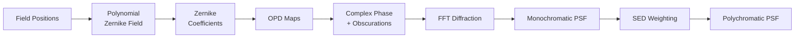

# WaveDiff-JAX

**Differentiable PSF modelling for astronomical imaging, powered by JAX.**

WaveDiff-JAX is a complete reimplementation of the [WaveDiff](https://github.com/CosmoStat/wf-psf) framework in [JAX](https://github.com/jax-ml/jax) and [Equinox](https://github.com/patrick-kidger/equinox). It models spatially-varying, polychromatic Point Spread Functions (PSFs) using Zernike polynomial wavefronts and FFT-based Fourier optics.

---

## Why WaveDiff-JAX?

The original WaveDiff was built on TensorFlow/Keras. This reimplementation brings:

- **JIT compilation** via JAX for fast GPU/TPU execution
- **Automatic vectorisation** with `jax.vmap` replacing nested `tf.map_fn` loops
- **Clean functional design** using Equinox modules — immutable PyTrees with explicit parameter management
- **Native autodiff** through the entire physics pipeline, from field positions to polychromatic PSF images

## At a Glance

```python
import jax
import wavediff_jax as wdj
from wavediff_jax.utils.math_utils import generate_zernike_maps_3d, obscurations_from_params

# Create optical elements
zernike_maps = generate_zernike_maps_3d(n_zernikes=15, pupil_diam=256)
obscurations = obscurations_from_params(pupil_diam=256)

# Build a parametric PSF model
model = wdj.models.parametric.ParametricPSFFieldModel(
    zernike_maps=zernike_maps,
    obscurations=obscurations,
    output_Q=1, output_dim=64, n_zernikes=15,
    d_max=2, x_lims=[0, 1e3], y_lims=[0, 1e3],
    key=jax.random.PRNGKey(42),
)

# Forward pass: field positions → polychromatic PSFs
psf_batch, opd_maps = model([positions, packed_seds])
```

## Physics Pipeline

The forward model flows through five stages:



1. **PolynomialZernikeField** maps field positions to Zernike coefficients via a trainable polynomial matrix
2. **ZernikeOPD** converts coefficient vectors to 2D Optical Path Difference (OPD) maps
3. **build_phase** constructs the complex pupil function, applying telescope obscurations
4. **fft_diffract** performs FFT-based Fraunhofer diffraction to produce PSF images
5. **SED weighting** uses `jax.vmap` over wavelength bins to synthesise polychromatic PSFs

## Three Model Architectures

| Model | Registry ID | Use Case |
|---|---|---|
| [Parametric](guide/models.md#parametric-model) | `"poly"` | Smooth wavefront variations across the field |
| [Semi-Parametric](guide/models.md#semi-parametric-model) | `"semi-param"` | Captures high-frequency OPD residuals |
| [Physical Polychromatic](guide/models.md#physical-polychromatic-model) | `"physical-poly"` | Incorporates ray-tracing priors |

## Test Suite

217 tests covering all components:

| Module | Tests |
|---|---|
| Optics primitives | 38 |
| Model layers & architectures | 34 |
| Training loop | 35 |
| Data loading | 17 |
| Simulation | 19 |
| Metrics | 29 |
| Utilities | 45 |

```bash
python -m pytest src/wavediff_jax/tests/ -v
```

## Next Steps

- [Installation](getting-started/installation.md) — set up your environment
- [Quick Start](getting-started/quickstart.md) — build and run your first model
- [Concepts](getting-started/concepts.md) — understand the key abstractions
- [API Reference](api/index.md) — complete function and class reference
